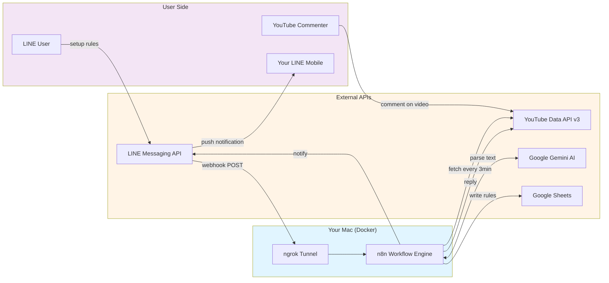
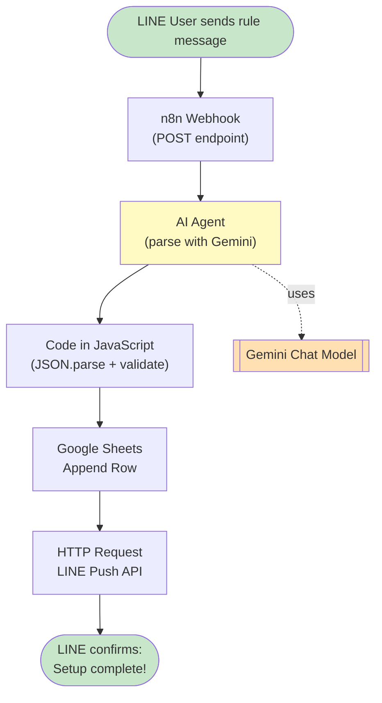
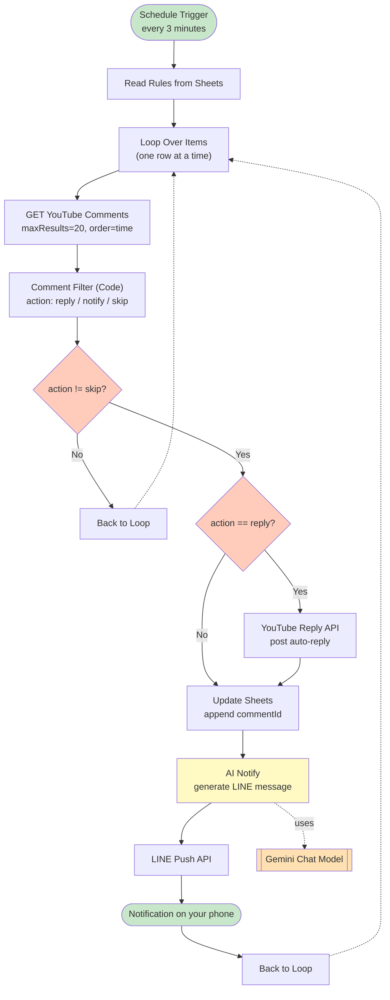

# n8n YouTube Comment Bot

An end-to-end automation system integrating LINE Messaging API, YouTube Data API v3, and Google Gemini AI via n8n workflow engine. Manage YouTube comments hands-free through conversational LINE configuration, automated keyword-based replies, and real-time AI-generated notifications.

[](https://n8n.io)
[](https://www.docker.com)
[](https://developers.line.biz)
[](https://developers.google.com/youtube/v3)
[](https://ai.google.dev)
[](LICENSE)

---

## Table of Contents

- [Features](#features)
- [Architecture](#architecture)
- [Tech Stack](#tech-stack)
- [Prerequisites](#prerequisites)
- [Setup Guide](#setup-guide)
- [Workflow 1: Rule Setup](#workflow-1-rule-setup)
- [Workflow 2: Auto-Reply](#workflow-2-auto-reply)
- [LINE Webhook Configuration](#line-webhook-configuration)
- [Testing](#testing)
- [Troubleshooting](#troubleshooting)
- [Repository Structure](#repository-structure)
- [Migration Note](#migration-note)
- [License](#license)

---

## Features

- **Natural Language Setup via LINE** — Configure monitoring rules through conversational LINE messages. Gemini AI parses unstructured input into structured JSON and writes directly to Google Sheets. Supports both single and batch entries.

- **Scheduled Auto-Reply** — Polls latest YouTube comments every 3 minutes via YouTube Data API v3. Filters out already-processed comments and the channel owner's own replies. Keyword-matched comments receive automated replies on YouTube.

- **AI-Generated Real-Time Notifications** — Gemini dynamically generates LINE notifications categorized as "Auto-Replied" or "Pending Review", helping creators stay updated without checking YouTube manually.

- **Privacy-First Self-Hosted** — Runs entirely on your local machine via Docker. No third-party cloud workflow services. All credentials and data remain on your device.

---

## Architecture

### System Overview



### Workflow 1: Rule Setup via LINE



### Workflow 2: Scheduled Auto-Reply



---

## Tech Stack

| Layer | Tools |
|---|---|
| Workflow Engine | n8n (self-hosted) |
| Container | Docker, docker-compose |
| Tunneling | ngrok |
| AI | Google Gemini API (gemini-3-flash-preview) |
| APIs | LINE Messaging API, YouTube Data API v3, Google Sheets API |
| Auth | OAuth 2.0, Bearer Token, Header Auth |
| Storage | Google Sheets (rule storage), n8n SQLite (workflow state) |

---

## Prerequisites

- macOS 12 Monterey+ (Apple Silicon or Intel) — Windows and Linux supported with minor path adjustments
- Docker Desktop installed and running
- ngrok account (free plan)
- Google account (for YouTube, Sheets, Gemini)
- LINE account (for Messaging API)

---

## Setup Guide

### Phase 1: Environment Setup

#### 1.1 Install Docker Desktop

Download from [docker.com](https://www.docker.com/products/docker-desktop) and start the daemon.

```bash
docker --version
docker compose version
```

#### 1.2 Get ngrok Token and Domain

1. Sign up at [ngrok.com](https://ngrok.com)
2. Copy your Authtoken from dashboard
3. Go to **Domains** → **New Domain** → reserve a free static domain (e.g. `your-name.ngrok-free.dev`)

#### 1.3 Create docker-compose.yml

```bash
mkdir -p ~/n8n-local
cd ~/n8n-local
cp /path/to/cloned/docker-compose.example.yml docker-compose.yml
nano docker-compose.yml
```

Replace `YOUR_NGROK_DOMAIN` and `YOUR_NGROK_TOKEN` with your real values.

#### 1.4 Launch

```bash
docker compose up -d
```

Open [http://localhost:5678](http://localhost:5678) to set up your n8n admin account.

---

### Phase 2: API Credentials

#### 2.1 Google Cloud Console

1. Create a project at [console.cloud.google.com](https://console.cloud.google.com)
2. Enable APIs:
   - Google Sheets API
   - YouTube Data API v3
   - Google Drive API
3. Configure OAuth consent screen (External) and add yourself as a test user
4. Create OAuth 2.0 Client ID (Web Application) with redirect URIs:
   ```
   http://localhost:5678/rest/oauth2-credential/callback
   https://YOUR_NGROK_DOMAIN.ngrok-free.dev/rest/oauth2-credential/callback
   ```
5. Save Client ID and Client Secret

#### 2.2 Gemini API Key

1. Visit [aistudio.google.com](https://aistudio.google.com)
2. Create API key
3. Enable Cloud Billing if you encounter quota errors (free trial includes $300 credit)

#### 2.3 LINE Messaging API

1. Visit [developers.line.biz](https://developers.line.biz)
2. Create Provider → Create LINE Official Account → Enable Messaging API
3. Get Channel Access Token (long-lived)
4. Get Your User ID from Basic settings
5. Disable auto-reply messages in LINE Official Account Manager
6. Add the bot as friend via QR code

---

### Phase 3: n8n Credentials

Navigate to `http://localhost:5678/home/credentials` and create:

| Credential Name | Type | Configuration |
|---|---|---|
| Google Sheets account | Google Sheets OAuth2 API | Client ID + Secret → Sign in |
| Google OAuth2 account | Google OAuth2 API | Same Client ID + Secret + Scope: `https://www.googleapis.com/auth/youtube.force-ssl` → Sign in |
| Google Gemini(PaLM) Api account | Google Gemini(PaLM) API | API Key |
| Header Auth account | Header Auth | Name: `Authorization`, Value: `Bearer YOUR_LINE_CHANNEL_TOKEN` |

---

### Phase 4: Google Sheets

Create a new spreadsheet named `YT_Auto_Reply_Comments` with these column headers (A1:F1):

| youtube_url | ID | keyword | reply | check_time | replied_ids |
|---|---|---|---|---|---|

---

### Phase 5: Import Workflows

In n8n, click the menu icon → **Import from File**. Import the two JSON files:

- `workflows/YT_reply_settings.json` (Workflow 1)
- `workflows/YT_auto_reply.json` (Workflow 2)

After import:

1. Re-link credentials in each node (n8n does not auto-bind credentials across imports)
2. Update `ownChannelId` in the Comment Filter Code node (Workflow 2) to your YouTube channel ID
3. Update `YOUR_LINE_USER_ID` in the LINE Push node (Workflow 2) to your LINE User ID
4. See [Migration Note](#migration-note) if you want to use English node names

---

## Workflow 1: Rule Setup

**Total nodes**: 5 + 1 sub-node

### Node 1: Webhook

| Field | Value |
|---|---|
| HTTP Method | POST |
| Path | (auto-generated UUID) |
| Respond | Immediately |

Save the **Production URL** for LINE Webhook setup.

### Node 2: Gemini Chat Model (Sub-node)

| Field | Value |
|---|---|
| Credential | Google Gemini(PaLM) Api account |
| Model | `models/gemini-3-flash-preview` |
| Sampling Temperature | 0 |

### Node 3: AI Agent

| Field | Value |
|---|---|
| Source for Prompt | Define below |
| Prompt | `={{ $json.body.events[0].message.text }}` |

**System Message**:

```
You are a strict data formatter. Your task is to parse user messages into JSON.

Absolute Rules - Never Violate
1. Output JSON only. No explanation text, emoji, or preamble.
2. Never wrap with markdown code fences.
3. No prefix or suffix.
4. For multiple entries: each on its own line, separated by \n.
5. For single entry: output only one line of JSON.

Format
{"url":"full_url","id":"video_id","key":"keyword","reply":"reply_text"}

Field Rules
- id: must be exactly 11 chars (A-Z, a-z, 0-9, -, _)
  Examples:
    https://youtu.be/AcO7g7tS4Ew -> AcO7g7tS4Ew
    https://youtu.be/AcO7g7tS4Ew?si=xxx -> AcO7g7tS4Ew (ignore ?si=)
    https://www.youtube.com/watch?v=AcO7g7tS4Ew -> AcO7g7tS4Ew
- No leading or trailing whitespace on any field
- Strings must be quoted

Output ONLY the JSON. Nothing else.
```

Connect Gemini Chat Model to AI Agent's **Chat Model** slot.

### Node 4: Code in JavaScript

| Field | Value |
|---|---|
| Mode | Run Once for All Items |
| Language | JavaScript |

```javascript
const raw = $input.item.json.output.replace(/```json|```/g, '').trim();

const lines = raw.split('\n').filter(line => line.trim());
const results = [];

for (const line of lines) {
  try {
    const data = JSON.parse(line.trim());

    if (!data.url || !data.id || !data.key || !data.reply) {
      console.log('Missing field, skipping:', line);
      continue;
    }

    if (!/^[A-Za-z0-9_-]{11}$/.test(String(data.id).trim())) {
      console.log('Invalid id format, skipping:', data.id);
      continue;
    }

    results.push({
      json: {
        url: String(data.url).trim(),
        id: String(data.id).trim(),
        key: String(data.key).trim(),
        reply: String(data.reply).trim()
      }
    });
  } catch (e) {
    console.log('JSON parse failed, skipping:', line, e.message);
  }
}

if (results.length === 0) {
  throw new Error('AI returned no valid data');
}

return results;
```

### Node 5: Google Sheets (Append Row)

| Field | Value |
|---|---|
| Credential | Google Sheets account |
| Resource | Sheet Within Document |
| Operation | Append Row |
| Document | YT_Auto_Reply_Comments |
| Sheet | Sheet1 |
| Mapping Column Mode | Map Each Column Manually |

Column mappings:

| Column | Value |
|---|---|
| youtube_url | `{{ $json.url }}` |
| ID | `{{ $json.id }}` |
| keyword | `{{ $json.key }}` |
| reply | `{{ $json.reply }}` |

### Node 6: HTTP Request (LINE Push)

| Field | Value |
|---|---|
| Method | POST |
| URL | `https://api.line.me/v2/bot/message/push` |
| Authentication | Generic Credential Type |
| Generic Auth Type | Header Auth |
| Credential | Header Auth account |
| Send Headers | on |
| Specify Headers | Using Fields Below |
| Header Name / Value | `Content-Type` / `application/json` |
| Send Body | on |
| Body Content Type | JSON |
| Specify Body | Using JSON |
| Settings → Execute Once | on |

**JSON Body**:

```javascript
{{ JSON.stringify({
  to: $('Webhook').item.json.body.events[0].source.userId,
  messages: [{
    type: 'text',
    text: $('Code in JavaScript').all().length === 1
      ? 'Setup complete!\n\nVideo: ' + $('Code in JavaScript').first().json.url
        + '\nKeyword: ' + $('Code in JavaScript').first().json.key
        + '\nAuto-reply: ' + $('Code in JavaScript').first().json.reply
      : 'Setup complete! Added ' + $('Code in JavaScript').all().length + ' rules:\n\n' +
        $('Code in JavaScript').all().map((item, i) =>
          (i+1) + '. Video: ' + item.json.url +
          '\n   Keyword: ' + item.json.key +
          '\n   Reply: ' + item.json.reply
        ).join('\n\n')
  }]
}) }}
```

---

## Workflow 2: Auto-Reply

**Total nodes**: 12

### Node 1: Schedule Trigger

| Field | Value |
|---|---|
| Trigger Interval | Minutes |
| Minutes Between Triggers | 3 |

### Node 2: Read Rules (Google Sheets - Get Rows)

| Field | Value |
|---|---|
| Credential | Google Sheets account |
| Operation | Get Row(s) |
| Document | YT_Auto_Reply_Comments |
| Sheet | Sheet1 |

### Node 3: Loop Over Items

| Field | Value |
|---|---|
| Batch Size | 1 |

### Node 4: GET YouTube Comments (HTTP Request)

| Field | Value |
|---|---|
| Method | GET |
| URL | `https://www.googleapis.com/youtube/v3/commentThreads` |
| Authentication | Predefined Credential Type |
| Credential Type | Google OAuth2 API |
| Credential | Google OAuth2 account |
| Send Query Parameters | on |

Query Parameters:

| Name | Value |
|---|---|
| part | snippet |
| videoId | `{{ $('Loop Over Items').item.json['ID'] }}` |
| maxResults | 20 |
| order | time |

### Node 5: Comment Filter (Code)

Replace `ownChannelId` with your YouTube channel ID:

```javascript
const loopRow = $('Loop Over Items').item.json;
const ytItems = $input.first().json.items || [];

// Force string conversion + trim to handle numeric or TAB-prefixed values
const keyword     = String(loopRow['keyword'] || '').trim();
const replyText   = String(loopRow['reply'] || '').trim();
const existingIds = String(loopRow['replied_ids'] || '').trim();
const ownChannelId = 'UCxxxxxxxxxxxxxxxxxxx'; // Replace with your channel ID

// Aggregate processed IDs across all rows of the same video
const allRows = $('Read Rules').all().map(i => i.json);
const existingList = allRows
  .filter(r => String(r['youtube_url'] || '').trim() === String(loopRow['youtube_url'] || '').trim())
  .flatMap(r => String(r['replied_ids'] || '').trim().split(',').filter(x => x.trim()));

// Filter: exclude already-processed + own channel
const newComments = ytItems.filter(item => {
  const id     = item.snippet.topLevelComment.id;
  const author = item.snippet.topLevelComment.snippet.authorChannelId?.value;
  return !existingList.includes(id) && author !== ownChannelId;
});

// Categorize
const toReply  = newComments.filter(c =>
  c.snippet.topLevelComment.snippet.textDisplay.includes(keyword)
);
const toNotify = newComments.filter(c =>
  !c.snippet.topLevelComment.snippet.textDisplay.includes(keyword)
);

// Pick ONE per execution (priority: reply > notify)
const target = toReply[0] || toNotify[0] || null;
if (!target) return [{ json: { action: 'skip' } }];

const action = toReply.includes(target) ? 'reply' : 'notify';

// Guard: notify only from the row with smallest row_number
if (action === 'notify') {
  const sameVideoMinRow = Math.min(...allRows
    .filter(r => String(r['youtube_url'] || '').trim() === String(loopRow['youtube_url'] || '').trim())
    .map(r => r['row_number']));
  if (loopRow['row_number'] !== sameVideoMinRow) {
    return [{ json: { action: 'skip' } }];
  }
}

const comment = target.snippet.topLevelComment;

return [{ json: {
  action,
  row_number:  loopRow['row_number'],
  commentId:   comment.id,
  text:        comment.snippet.textDisplay,
  author:      comment.snippet.authorDisplayName,
  videoId:     target.snippet.videoId,
  youtube_url: String(loopRow['youtube_url'] || '').trim(),
  replyText,
  existingIds
}}];
```

### Node 6: Has Action? (If)

| Field | Value |
|---|---|
| First Value | `{{ $json.action }}` |
| Operation | is not equal to |
| Second Value | skip |

- **True** → Node 7 (Needs Reply?)
- **False** → Back to Loop Over Items

### Node 7: Needs Reply? (If)

| Field | Value |
|---|---|
| First Value | `{{ $json.action }}` |
| Operation | is equal to |
| Second Value | reply |

- **True** → Node 8 (YouTube Reply)
- **False** → Node 9 (Update Reply Records)

### Node 8: YouTube Reply (HTTP Request)

| Field | Value |
|---|---|
| Method | POST |
| URL | `https://www.googleapis.com/youtube/v3/comments` |
| Authentication | Predefined Credential Type |
| Credential Type | Google OAuth2 API |
| Credential | Google OAuth2 account |
| Send Query Parameters | on (`part: snippet`) |
| Send Body | on |
| Body Content Type | JSON |
| Specify Body | Using JSON |

**JSON Body**:

```javascript
{{ JSON.stringify({
  snippet: {
    parentId: $('Comment Filter').item.json.commentId,
    textOriginal: $('Comment Filter').item.json.replyText
  }
}) }}
```

### Node 9: Update Reply Records (Google Sheets - Update Row)

| Field | Value |
|---|---|
| Credential | Google Sheets account |
| Operation | Update Row |
| Document | YT_Auto_Reply_Comments |
| Sheet | Sheet1 |
| Column to match on | row_number |

Column mappings:

| Column | Value |
|---|---|
| row_number | `{{ $('Comment Filter').item.json['row_number'] }}` |
| youtube_url | `{{ $('Comment Filter').item.json['youtube_url'] }}` |
| check_time | `{{ $now.toFormat('yyyy-MM-dd HH:mm:ss') }}` |
| replied_ids | `{{ ($('Comment Filter').item.json['existingIds'] ? $('Comment Filter').item.json['existingIds'] + ',' : '') + $('Comment Filter').item.json['commentId'] }}` |

### Node 10: Gemini Chat Model (Sub-node)

| Field | Value |
|---|---|
| Credential | Google Gemini(PaLM) Api account |
| Model | `models/gemini-3-flash-preview` |
| Sampling Temperature | 0.3 |

### Node 11: AI Notify (AI Agent)

| Field | Value |
|---|---|
| Source for Prompt | Define below |

**Prompt**:

```javascript
={{ $('Comment Filter').item.json.action === 'reply'
  ? 'Auto-replied to @' + $('Comment Filter').item.json.author
    + '\'s comment: "' + $('Comment Filter').item.json.text + '"'
    + ', reply: ' + $('Comment Filter').item.json.replyText
  : 'New comment needs review, from: @' + $('Comment Filter').item.json.author
    + ', content: "' + $('Comment Filter').item.json.text + '"'
}}
```

**System Message**:

```
You are a LINE notification assistant for a YouTube channel.

Task
Generate a concise LINE notification based on the provided comment info.

Format Rules - Strict
1. Auto-replied notifications start with a checkmark symbol
2. Pending-review notifications start with a warning symbol
3. Total length under 100 chars
4. Max 4 lines
5. No prefix like "Here is..." or "Notification:"
6. No markdown formatting
7. Output the message directly
```

Connect Gemini Chat Model to AI Notify's **Chat Model** slot.

### Node 12: LINE Push (HTTP Request)

| Field | Value |
|---|---|
| Method | POST |
| URL | `https://api.line.me/v2/bot/message/push` |
| Authentication | Generic Credential Type |
| Generic Auth Type | Header Auth |
| Credential | Header Auth account |
| Send Headers | on |
| Header Name / Value | `Content-Type` / `application/json` |
| Send Body | on |
| Body Content Type | JSON |
| Specify Body | Using JSON |

**JSON Body** (Replace `YOUR_LINE_USER_ID`):

```javascript
{{ JSON.stringify({
  to: 'YOUR_LINE_USER_ID',
  messages: [{
    type: 'text',
    text: $json.output + '\n\nVideo link: ' + $('Comment Filter').item.json.youtube_url
  }]
}) }}
```

### Final Connections

- LINE Push output → back to Loop Over Items input
- Has Action? false → back to Loop Over Items input
- Delete any auto-generated loop-back from GET YouTube Comments directly to Loop

---

## LINE Webhook Configuration

1. Open [LINE Developers Console](https://developers.line.biz)
2. Navigate to your Messaging API channel → **Messaging API** tab
3. Set Webhook URL to Workflow 1's Production URL:
   ```
   https://YOUR_NGROK_DOMAIN.ngrok-free.dev/webhook/YOUR_WEBHOOK_UUID
   ```
4. Click **Verify** (should return Success)
5. Enable **Use webhook** toggle

---

## Testing

### Test Workflow 1

Send to your LINE bot:

```
https://youtu.be/dQw4w9WgXcQ keyword:subscribe reply:thanks for subscribing
```

Expected:
- LINE bot replies with "Setup complete!"
- New row appears in Google Sheets

### Test Workflow 2

1. Have a friend (or alternate account) comment "I subscribed" on your video
2. Manually trigger Workflow 2 or wait 3 minutes
3. Expected:
   - YouTube reply appears under the friend's comment
   - LINE push notification arrives on your phone

---

## Troubleshooting

| Issue | Solution |
|---|---|
| videoNotFound 404 | Comments disabled / video is Unlisted or Private / "Made for Kids" set to Yes / YouTube Short (API limited) |
| Gemini 429 quota: 0 | Enable Cloud Billing on the project linked to your Gemini key |
| Invalid reply token | LINE Reply tokens expire in 30s — use Push API as documented |
| JSON parse failed at position N | AI returned multiple JSONs; Code now handles this with `split('\n')` |
| `.trim is not a function` | Sheets returned a number; Code wraps values with `String()` |
| Loop only processes 1 row | Confirm Read Rules node returns all items (no "Return only First Matching Row" option) |
| HTTP Request runs N times | Enable **Execute Once** in Settings tab |
| LINE comments disappear after refresh | YouTube spam filter — diversify reply text, avoid template responses |
| `Permission denied (publickey)` | SSH key not yet added to GitHub Settings → SSH keys |

---

## Repository Structure

```
n8n-YouTube-Comment-Bot/
├── README.md
├── docker-compose.example.yml
├── .gitignore
├── workflows/
│   ├── YT_reply_settings.json    # Workflow 1
│   └── YT_auto_reply.json        # Workflow 2
└── docs/
    └── architecture.png          # Optional architecture diagram
```

---

## Migration Note

The workflow JSON files in `/workflows` use legacy Chinese node names from the original development environment:

| Chinese (Original) | English (This README) |
|---|---|
| 讀取規則 | Read Rules |
| GET YouTube留言 | GET YouTube Comments |
| 留言過濾 | Comment Filter |
| 有動作? | Has Action? |
| 需要回覆? | Needs Reply? |
| YouTube回覆 | YouTube Reply |
| 更新已回覆紀錄 | Update Reply Records |
| LINE推播 | LINE Push |

Similarly for Sheets columns:

| Chinese (Original) | English (This README) |
|---|---|
| 關鍵字 | keyword |
| 回應 | reply |
| 檢查時間 | check_time |
| 已回覆留言ID | replied_ids |

### Option A: Use the Original JSON As-Is

Keep the Chinese names. The system will work — just remember the Code expressions reference Chinese names (e.g. `$('讀取規則').all()`).

### Option B: Rename to English (Recommended)

After importing the JSON:

1. Open each node and rename it to the English equivalent
2. Update the Code node expressions to reference the new English names:
   - `$('讀取規則')` → `$('Read Rules')`
   - `$('留言過濾')` → `$('Comment Filter')`
3. Rename Google Sheets column headers to English
4. Update column references in Sheets nodes and Code

---

## Security Notes

- Never commit `docker-compose.yml` with real tokens. Use `docker-compose.example.yml` as the public template.
- Rotate Channel Access Tokens and OAuth Client Secrets periodically.
- Restrict OAuth scopes to minimum required (`youtube.force-ssl`).
- This system replies using your personal YouTube account. Do not deploy on competitors' or strangers' videos (violates YouTube ToS).

---

## License

MIT License — free to use, modify, and distribute.

---

## Acknowledgments

- [n8n](https://n8n.io) — workflow automation engine
- [Google Gemini](https://ai.google.dev) — LLM
- [LINE Messaging API](https://developers.line.biz)
- [YouTube Data API v3](https://developers.google.com/youtube/v3)
